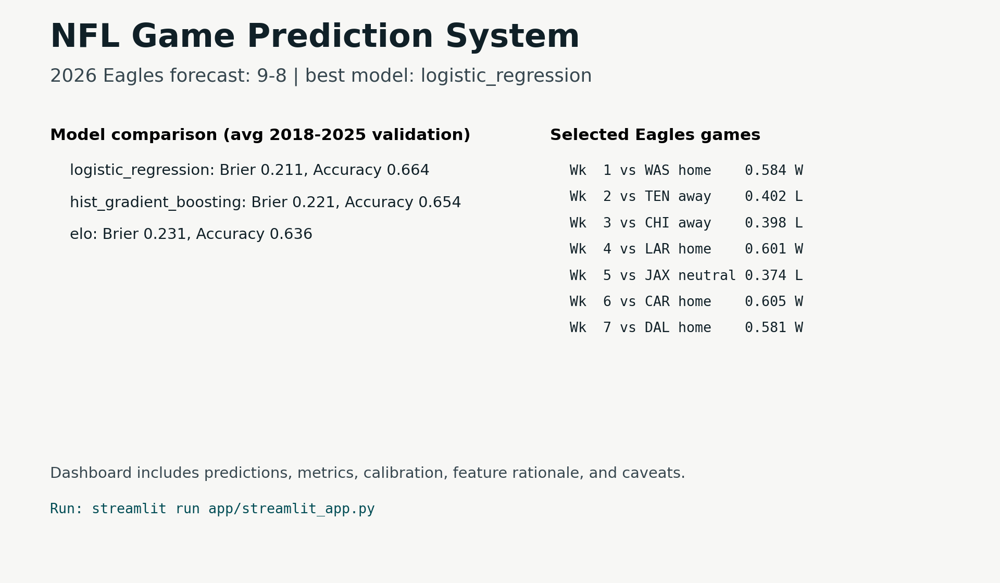

# NFL Game Prediction System

End-to-end machine learning project for predicting NFL game outcomes as calibrated
probabilities. The featured demo forecasts every 2026 Philadelphia Eagles regular-season game,
but the pipeline is built as a reusable NFL modeling system.



## Headline Result

The current season-forward validation selects **logistic regression** as the best model by average
Brier score. Using that model for the 2026 Eagles demo produces a preseason projection of **9-8**.

| Model | Seasons | Games | Brier | Log Loss | Accuracy |
| --- | ---: | ---: | ---: | ---: | ---: |
| Logistic Regression | 8 | 2,127 | 0.2111 | 0.6100 | 66.4% |
| Histogram Gradient Boosting | 8 | 2,127 | 0.2210 | 0.6372 | 65.4% |
| Elo Baseline | 8 | 2,127 | 0.2312 | 0.6629 | 63.6% |

## What This Demonstrates

- Data ingestion from nflverse-style schedules.
- Leak-free feature engineering from pregame information only.
- Baseline modeling with Elo.
- Supervised ML with scikit-learn logistic regression and histogram gradient boosting.
- Season-forward validation across 2018-2025.
- Probability evaluation with Brier score, log loss, accuracy, and calibration buckets.
- Streamlit dashboard for model communication and portfolio review.

## Tech Stack

Python, pandas, scikit-learn, matplotlib, Streamlit, pytest, ruff, nfl-data-py/nflverse data.

## Quick Start

```bash
python3 -m venv .venv
source .venv/bin/activate
python -m pip install -e '.[dev]'
```

Run the included portfolio artifacts:

```bash
eagles-ml predict-2026 --model best --output outputs/eagles_2026_predictions.csv
streamlit run app/streamlit_app.py
```

Open the dashboard at `http://localhost:8501`.

## Full Pipeline

The repository includes generated portfolio artifacts, so reviewers can inspect the dashboard
immediately. To rebuild the historical dataset and metrics:

```bash
python -m pip install -e '.[nflverse,dev]'
eagles-ml build-dataset --start 1999 --end 2025
eagles-ml evaluate --dataset data/processed/historical_games.csv
eagles-ml predict-2026 --model best --output outputs/eagles_2026_predictions.csv
```

If `nfl-data-py` is unavailable for your Python version, use the included processed dataset and run
the evaluation step directly.

## Project Structure

```text
app/streamlit_app.py                  Streamlit dashboard
data/processed/                       Clean schedule, priors, and historical feature table
docs/research.md                      Modeling research notes and source links
outputs/                              Forecasts, validation metrics, calibration, chart artifacts
src/eagles_ml/                        CLI, data loading, features, models, evaluation, reporting
tests/                                Unit and smoke tests
MODEL_REPORT.md                       Portfolio model report
PROJECT_GUIDE.md                      Component-level project walkthrough
```

## Feature Engineering

The historical table is built from information available before kickoff:

- Pregame Elo difference and Elo-implied win probability.
- Rolling point margin and rolling win rate.
- Rest-day differential.
- Betting spread and total when present.
- Temperature and wind when present.
- Divisional-game indicator.

Team state is updated after each game, which prevents current-game scores from leaking into the
features for that same game.

## Model Evaluation

Validation is season-forward: for each test season, the model trains on earlier seasons and
predicts that season. This is closer to real forecasting than random train/test splitting because
future NFL context is never used to predict the past.

The primary selection metric is Brier score because this project is about probability quality, not
just binary picks.

## Portfolio Artifacts

- `outputs/eagles_2026_predictions.csv`: game-by-game Eagles forecast.
- `outputs/model_metrics.csv`: season-forward model comparison.
- `outputs/calibration.csv`: probability bucket calibration.
- `outputs/model_comparison.png`: Brier score comparison chart.
- `outputs/calibration.png`: calibration chart.
- `MODEL_REPORT.md`: model report written for a technical reviewer.

## Resume Bullets

- Built an end-to-end NFL win-probability system in Python using nflverse data, leak-free rolling
  features, season-forward validation, and calibrated probability evaluation.
- Compared Elo, logistic regression, and histogram gradient boosting across 2,127 validation games,
  selecting the primary model by average Brier score while reporting log loss, accuracy, and
  calibration buckets.
- Developed a Streamlit dashboard and model report to communicate 2026 Eagles game probabilities,
  model performance, feature rationale, and preseason forecast limitations.

## Caveats

This is a portfolio forecasting system, not betting advice. The 2026 Eagles forecast is a
preseason projection and does not yet include finalized injuries, depth-chart changes,
quarterback availability, late market movement, or game-week weather forecasts.
